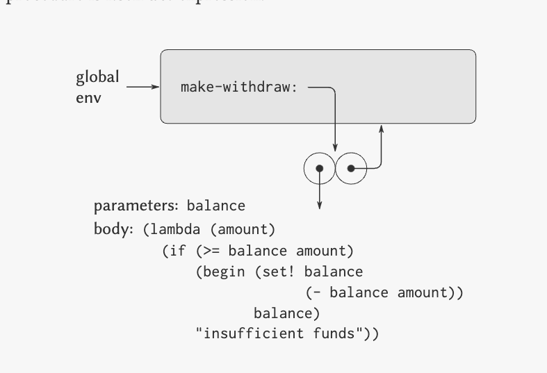
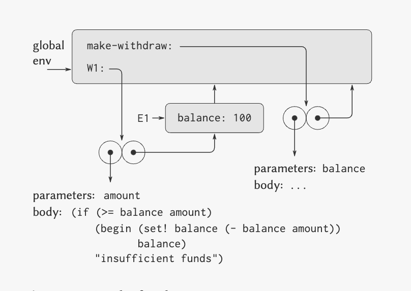

> Frames as Repository of local state.  

> Lets Analize the procedure 

```scheme
  (define (make-withdraw balance)
  (lambda (amount)
    (if (>= balance amount)
        (begin (set! balance 
                     (- balance amount))
               balance)
        "Insufficient funds")))
```
> This procedure, returns an lambda expression ( another procedure )  
> So, evaluating this procedure in global env creates something that look like this.

  
> Now, evaluating the procedure (make-withdraw 100) is where the interesting thing happen.  

``` scheme 
(make-withdraw 100)
```

> as we know, evaluting a λ expression, creates a frame, that locally binds the argument (100) to the value passed

  

> What is interesting here, is how this creates an Object (procedure and enviroment ) that is binding in the global enviroment but the enclosing enviroment of this procedure is not the global env.

> It is actually E1 with the local state 100, so calling

```scheme 
  (W1 50)
```
> I can Withdraw only from this enviroment, the frame E1 serves as a repository of local state to the object W1 where i can execute the code using always this enviroment.

> This, can make me create Multiple Objects with diferente local states, and execute the SAME CODE with diferente balance values.

> This only happens because evaluting make-withdraw returns also a procedure object, and because the enviroment model of evaluation, a new Frame E1 is created, keeping the local state.


